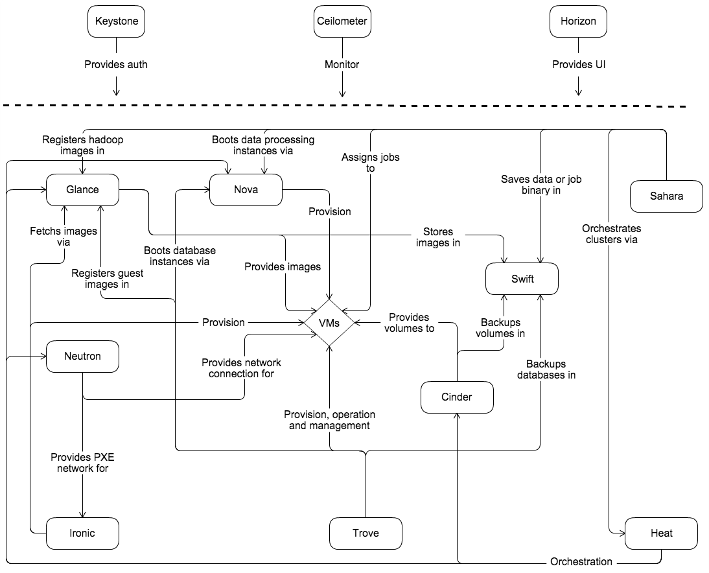
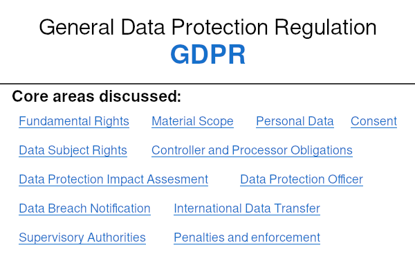

# 📡 Cloud Computing

This document contains guidelines and best practices for students working with cloud services:

📁 Navigation

- [☁️ What are cloud services?](#️-what-are-cloud-services)

- [🌐 Choosing the right Azure service type](#-choosing-the-right-azure-service-type)

- [🌍 Other cloud providers](#-other-cloud-providers)

- [🚀 Deploying a Docker Compose app to Azure Kubernetes Service (AKS)](#-deploying-a-docker-compose-app-to-azure-kubernetes-service-aks)

- [☁️ Deploying a Docker image to cPouta in CSC Cloud](#️-deploying-a-docker-image-to-cpouta-in-csc-cloud)
- [🔐 Cloud and web security essentials](#-cloud-and-web-security-essentials)

- [🛡️ Data privacy and GDPR compliance](#️-data-privacy-and-gdpr-compliance)

- [📚 Further reading](#-further-reading)

## ☁️ What are cloud services?

**Cloud services** are applications, infrastructure, and platforms hosted and delivered to the users over the internet. Common cloud service resources include servers, storage, databases, networking, software, and analytics. They allow developers to deploy and maintain applications without having to manage physical hardware. **Cloud computing** is the act of consuming resources, like cloud services, over the internet. As you don't need to buy your own hardware and software, or set up and maintain servers yourself, resources can be focused on building, testing, and scaling applications. The flexibility of cloud services allows quick prototyping, experimenting with new technologies like AI or microservices, and deployment of updates with minimal overhead. Cloud computing also enables on-demand scalability, meaning you only pay for what you use, so your application automatically grows as user demand increases.

**Microsoft Azure** is a cloud platform that offers a wide range of utilities, including computing, analytics, storage, networking, and AI services. With the wide range of tools and services available, Azure supports every stage of your cloud computing workflow. Students can apply for $100 of free Azure credits and access to developer tools with the [Azure for Students](https://azure.microsoft.com/free/students/) program.

Cloud services are usually categorized into different service models, which tell how each service is delivered and consumed. The most common models are:

- **On-Premises**: With on-premises infrastructure, all hardware and software is hosted and fully managed locally. This setup offers maximum control but requires significant resources for maintenance, scaling, and security.

- **Infrastructure as a Service** (IaaS): IaaS provides the most flexibility by giving you access to virtual machines, networks, and storage. You manage the OS, runtime, and deployments, while the provider handles the physical infrastructure. Use when you need full control over the environment, are deploying custom setups, or are training resource-intensive AI models with GPUs.

- **Platform as a Service** (PaaS): PaaS abstracts the infrastructure and lets you deploy code directly to managed environments, making their use more beginner-friendly. You don't worry about servers, OS patches, or scaling. Useful when the focus is on application logic, especially with web apps, APIs, or microservices.

- **Software as a Service** (SaaS): SaaS provides access to software tools without the need to deploy or manage anything yourself. Useful when a full platform is not needed, but only a particular service (e.g., pre-built APIs or development tools). 

<em>The Azure shared responsibility model distinguishes which security and management tasks are handled by Microsoft and which remain the user’s responsibility, depending on the service type (IaaS, PaaS, SaaS). Source: <a href="https://learn.microsoft.com/en-us/azure/security/fundamentals/shared-responsibility">Microsoft Learn</a>, licensed under CC-BY-4.0</em>

Besides these more traditional models, there are many specialized cloud service models tailored to distinct functions. These specialized services often overlap with the traditional categories but are sometimes noted separately because they address unique cloud computing needs. Examples include:

- **Function as a Service** (FaaS), also known as serverless computing, where you run small pieces of code triggered by events without managing servers (e.g., Azure Functions).

- **Container as a Service** (CaaS), which simplifies deploying and managing containerized applications using orchestration tools (e.g., Azure Kubernetes Service).

---

## 🌐 Choosing the right Azure service type

Azure offers [hundreds of different services](https://azure.microsoft.com/en-us/products), each with its own use case, and it can be difficult to identify which ones are the right picks for your specific application. Here are some of the main Azure service offerings used for computing, storage, networking, and AI/ML:

---

### 1. Compute options

- **Azure App Service** is a PaaS offering that allows you to build, deploy, and scale web apps, APIs, and backend services with minimal effort. It runs applications in sandboxed environments on Azure-managed virtual machines that automatically handle OS patching, load balancing, and scaling. App Service supports multiple frameworks, including containers, .NET, Node.js, Python, and Java, and provides built-in features like continuous deployment via GitHub or Azure DevOps, custom domains, SSL certificates, and authentication/authorization. Scaling can be configured manually or automatically based on metrics like CPU usage or request count.

- **Azure Container Instance** provides an easy way to deploy containers from images through registries. It is a cost-effective way to create either public or private applications but lacks advanced controls, like adding a static IP address. Container Instances are very useful for applications where container orchestration is not needed.

- **Azure Container Apps** is a fully managed container hosting service that simplifies deploying and scaling containerized applications without managing Kubernetes directly. It’s built on top of **Azure Kubernetes Service** (AKS), using technologies like [KEDA](https://keda.sh/), [Dapr](https://dapr.io/), and [Envoy](https://www.envoyproxy.io/) to support autoscaling, event-driven workloads, service discovery, and secure traffic routing. Container Apps can handle HTTP and background (non-HTTP) workloads, making them ideal for microservices, APIs, or background processors.

- **Azure Functions** is a managed FaaS (Function as a Service) solution which is optimized for running event-based functions. Functions provides a serverless architecture where solutions can be deployed as Azure code or as containers that can be easily linked to other Azure services.

---

### 2. Storage options

- **Azure Blob Storage** is designed for storing large amounts of unstructured data, such as text, images, videos, or backups. It’s ideal for use cases like serving media files, archiving logs, or training AI models with large datasets, and it can be connected to most Azure compute resources easily. Blobs can be accessed using **Azure Storage Explorer**, and supports tiered storage (hot, cool, archive) for cost efficiency. 

- **Azure SQL Database** is a managed relational DBaaS built on SQL Server. It’s best for structured data with complex querying and transactional support. Features like automatic backups, high availability, and variable load scaling make it suitable for applications requiring consistency and relational modeling. Offers discounts for development and testing environments.

- **Azure Table Storage** provides a NoSQL key-value store that is optimized for storing large amounts of structured, non-relational data. It’s a lightweight and cost-effective solution for storing datasets like user profiles, logs, or device telemetry where fast access and horizontal scalability are important.

---

### 3. Networking options

- **Virtual Networks** (VNet) create the basis for Azure networking by enabling secure communication between Azure resources and between on-premises and the cloud. They are essential when deploying apps using VMs or container services (like ACA or AKS). You can use a public IP address, NAT gateway, or public load balancers to manage outbound connections and communicate inbound by assigning a public IP address or a public load balancer.

- **Load balancers** distribute incoming network traffic across multiple instances of a service. Azure Load Balancer is used primarily with Azure VMs or VM scale sets that need high availability. It supports both inbound and outbound traffic scenarios and allows port forwarding to a public IP address and port. 

- **ExpressRoute** provides a private, dedicated connection between your on-premises infrastructure and Azure data centers. Unlike typical VPNs over the public internet, ExpressRoute offers higher security, reliability, and lower latency, which makes it ideal for hybrid cloud setups.

---
## 🇫🇮 CSC Cloud for academic cloud computing

[CSC Cloud](https://research.csc.fi/cloud-computing/) is a Finnish research-focused cloud provider that offers scientific computing and data management tools and services. All of their services are hosted within CSC's secure data centers in Kajaani, Finland. 

**Best for:** Academic and research projects requiring Finnish data residency. Great for hosting web services (**Rahti**), deploying custom VMs (**cPouta**, **ePouta**), and running resource-intensive workloads (**Mahti**, **Puhti**).

#### Why use CSC Cloud?
- CSC Cloud services are free for researchers and students doing research
- All data stays in Finland, making it ideal for sensitive datasets and for following GDPR compliance easily
- Services are easy to access using student credentials through the Haka system

#### Useful tools from CSC Cloud:
- **IaaS**
    - cPouta / ePouta: Virtual machine infrastructure for customizable environments
    - Puhti / Mahti: High-performance computing clusters for AI and simulations

- **PaaS**
    - Rahti: OKD (OpenShift Kubernetes Distribution)-based container orchestrator

- **SaaS**
    - Jupyter Notebook on Puhti

- **DBaaS**
    - Allas: Object storage

## 🌍 Other cloud providers

### [Google Cloud Platform](https://cloud.google.com/)
**Best for:** Projects focused on big data, machine learning, and scalable, containerized applications. GCP excels in data analytics with **BigQuery** and offers end-to-end ML development with **Vertex AI** and frameworks like **TensorFlow**.

#### Why use Google Cloud Platform?
- A 90-day, $300 free credit trial is available through the [Free Tier](https://cloud.google.com/free) with full access to all Google Cloud resources ([with exceptions](https://cloud.google.com/free/docs/free-cloud-features#free-trial))
- Excellent tools for ML workflows, including pre-trained APIs and custom model deployment
- Deep integration with other Google services (e.g., Colab, Firebase)

#### Useful tools from GCP

- **IaaS**
    - Compute Engine: Virtual machines with GPU options
    - Google Kubernetes Engine (GKE): Managed Kubernetes clusters for container orchestration

- **PaaS**
    - App Engine: Fully managed serverless app platform
    - Cloud Run: Run containers in a serverless environment

- **SaaS**
    - BigQuery: Serverless data warehouse
    - Vertex AI: Pre-trained APIs

- **DBaaS**
    - Cloud SQL
    - Firestore
    - Bigtable

---

### [Amazon Web Services (AWS)](https://aws.amazon.com/)

**Best for:** Projects needing global infrastructure, scalable deployment, or access to advanced AI/ML services. AWS provides a free tier with limited compute, storage, and database resources for 12 months, plus always-free offers for some services.

#### Why use Amazon Web Services:

- Broadest selection of services across IaaS, PaaS, SaaS, and DBaaS categories
- [AWS Educate](https://aws.amazon.com/education/awseducate/) offers cloud training and self-paced courses for free

#### Useful tools from AWS

- **IaaS**
    - EC2: Scalable computing capacity in AWS Cloud
    - ECS and EKS: Container orchestration with Amazon Elastic Container Service or Kubernetes

- **PaaS**
    - Lambda: Serverless compute service for event-based workloads
    - Elastic Beanstalk: Managed app deployment platform

- **SaaS**
    - Amazon SageMaker: Fully managed ML development environment

- **DBaaS**
    - S3: Object storage
    - RDS: Relational databases

## 🚀 Deploying a Docker Compose app to Azure Kubernetes Service (AKS)

After creating a multi-container Flask + Redis app with Docker Compose (see [`containers/README.md`](containers/README.md)) and converting it to run in a Kubernetes environment, you're ready to move from local development to the cloud. For this example, we are using the Azure Kubernetes Service (AKS). 

The final app will be using the following Azure resource architecture:

    Subscription: Azure for Students
    └── Resource Group: AKS-RG1
        ├── AKS Cluster: AKS-Cluster1
        │   ├── Runs your Kubernetes workloads
        │   └── Connected to a virtual network (VNet) for networking
        └── Azure Container Registry (ACR)
            └── Stores your Docker images used by AKS

### Prerequisites

Make sure you have the following installed and set up:

- [Docker](https://docs.docker.com/get-started/get-docker/)

    Make sure that Docker is running and that Kubernetes is enabled in Settings > Kubernetes > Enable Kubernetes

- [Azure CLI](https://learn.microsoft.com/en-us/cli/azure/install-azure-cli?view=azure-cli-latest)

---

### 1. Create a new Resource Group and Azure Container Registry:

First, log into your Azure account in the terminal:

    az login

Then, make sure that the Azure for Studets subscription is selected.

---

### 2. Create a Resource group and Container Registry

Create a resource group to hold our resources:

    az group create --name AKS-RG1 --location northeurope

Create a new Azure Container Registry (ACR) inside our Resource Group:

    az acr create --resource-group AKS-RG1 --name <your-acr-name> --sku Basic --admin-enabled true

>Replace \<your-acr-name> with a unique name

---

### 3. Push Docker images to the Azure Container Registry

First, log in to the ACR server:

    az acr login --name <your-acr-name>

Then, tag and push the image:
    
    docker tag my-web-app <your-acr-name>.azurecr.io/my-web-app.latest
    docker push <your-acr-name>.azurecr.io/my-web-app.latest

---

### 4. Create an AKS cluster

You can create the cluster through the **Azure Portal**:

1. Start by going to the Azure Portal, and search for **Azure Kubernetes Service** and click **Create**.

2. Under the **Basics** tab, set **Resource group** to the one you are using (AKS-RG1), and name the **Kubernetes cluster** as `AKS-Cluster1`.

3. Next under **Node pools**, click the `agentpool` Node pool to edit it. In **Availability zones** unselect all, and in **Node size**, click *Choose a size* and select *A2_v2* under *Most used by Azure users*. Then, set **Max pods per node** to 30. Click *Update* at the bottom.

4. In **Networking**, select *Azure CNI Node Subnet* for the **Network Configuration**

5. For **Integrations**, select the correct **Container registry** under the resource group (AKS-RG1).

6. In **Monitoring**, select **Enable Container Logs** 

Finally, make sure the **Review + create** section passes your configuration, and click **Create**. 

---

### 5. Connect to the AKS Cluster

After the Deployment has been created successfully, click **Go to resource** to see the newly created cluster. We can use a terminal to connect to it using:

    az aks get-credentials --resource-group AKS-RG1 --name AKS-Cluster1

Now we can use `kubectl` to access the cluster. Test out the connection with:

    kubectl get nodes

If you see a list of nodes, you have connected successfully.

---

### 6. Update your Kubernetes manifests

Update the `web-deployment.yaml` to point to the correct image at your registry with:

    image: <your-acr-name>.azurecr.io/my-web-app:latest
    imagePullPolicy: Always

And update `web-service.yaml` to use a LoadBalancer:

    spec:
        type: LoadBalancer

---

### 7. Deploy the project to AKS

Apply your manifests by using: 

    kubectl apply -f .

Now you should see the newly created pods by running:

    kubectl get pods

Check service status to get the external IP of the web service LoadBalancer:

    kubectl get svc

You should see an output similar to this:

    NAME         TYPE           CLUSTER-IP     EXTERNAL-IP     PORT(S)          AGE
    web          LoadBalancer   10.0.70.122    20.85.43.110    3000:3000/TCP    2m
    redis        ClusterIP      10.0.6.17      <none>          6379/TCP         2m

Visit your app in the browser:

    http://<EXTERNAL-IP>:3000/

---

### Troubleshooting

LoadBalancer IP is \<pending>?

- It may take a minute or two for the `EXTERNAL-IP` to be assigned

- Check AKS service description and logs with 
    
        kubectl describe svc web

Image pull errors?

- Ensure the ACR is properly linked to your AKS

- Check that the image name and tag in your manifest exactly match the pushed image

---

### Monitoring and managing your AKS Deployment

After the application has been deployed and is running, it is important to watch how it performs and behaves under load. Azure provides built-in tools through the Azure portal for monitoring, logging, and performance, and allows you to analyze performance through resource usage, logs, and availability. In our AKS deployment, just looking at the overview page already gives us plenty of basic information about our cluster, such as:
- Resource group, Subscription and Location
- Cluster state
- Kubernetes API server endpoint
- Node pools in use
- Connected Container registries

By going to the **Monitor** tab, we can see how our Nodes and Pods are performing. On the page you can see the Cluster overview, Node metrics, Pod status, and Resource usage. Since we set "Enable Container Logs" during the AKS setup, Azure Monitor is also collecting `stdout` and `stderr` logs from our running containers. These logs are sent to Logs, where they can be queried, visualized, and used for alerting and diagnostics.

## ☁️ Deploying a Docker image to cPouta in CSC Cloud

cPouta is CSC's Infrastructure-as-a-Service (IaaS) cloud platform solution. It's a virtualization platform powered by OpenStack, a collection of open-source software that together provides the necessary cloud infrastructure. cPouta allows its users to create and manage virtual machines, storage and networking instances through a web interface or APIs.

<em>Openstack service diagram showing how different services are interacting to create the environment. Source: <a href="https://docs.openstack.org/install-guide/get-started-conceptual-architecture.html">OpenStack documentation</a>, licensed under CC BY 3.0.</em>

The main functionality within the OpenStack architecture consists of the following: 
- Nova for computing/virtual machines
- Neutron for networking
- Cinder for block storage
- Keystone for identity/authentication
- Glance for image services

---

This tutorial will guide you through deploying a Docker containerized application to cPouta

### Prerequisites
Before starting, ensure you have:

- Docker installed on your local machine
- Basic knowledge of Docker and Linux command line
- Your application containerized in a Docker image

### **1. Access cPouta Dashboard**

Start by creating a new project, adding cPouta to it, and going to the cPouta dashboard from [My CSC](my.csc.fi/dashboard)

---

### **2. Add an SSH key and a Security Group**

Now you should have arrived in the cPouta dashboard view. 

Start by setting up your SSH keys. Create an SSH keypair or use a pre-existing one, and in Compute > Key Pairs, click "Create Key Pair". Add your public key there, along with a name you can use to log into the VM instance.

Next, add a security group by going to Network > Security Groups. Click "Create Security Group", to create a new group. Click "Manage Rules" on your new group, and add a new rule with:

- Port: 22 for SSH connection
- CIDR: your ip address (you can use https://apps.csc.fi/myip/)

Other settings can be left as defaults. 

Then, add a new rule for your application:

- Port: the port your app is using (e.g., 3000)
- CIDR: IP address

---

### **3. Create a Virtual Machine**

Head to Compute > Instances and click on "Launch Instance", where you can configure your setup. In Details, you need to change "Instance Boot Source" to "Boot from image", and add e.g., `Ubuntu-22.04` as your image. 

Then, make sure your SSH key shows up in the Access & Security section. 

The rest can be left as defaults. Click "Launch".

---

### **4. Add a floating IP address**

To access your application reliably, we need a floating IP address. Head to Network > Floating IPs and click on "Allocate IP to Project". 

Create a new Address and then click "Associate, where you can select your instance port. After that, click "Associate".

---

### **5. Accessing your instance using SSH**

Open up your terminal, and use SSH to log into the system. Use the following command:

    ssh ubuntu@<instance-floating-ip> -i /path/to/your/private-key

You should now be in the instance terminal as `ubuntu@<instance-name>`

---

### **6. Install Docker**

On Ubuntu:

    # Update packages
    sudo apt update

    # Install Docker
    sudo apt install docker.io

    # Start and enable Docker service
    sudo systemctl start docker
    sudo systemctl enable docker

---

### **7. Deploy Your Docker Image**

You can either use a pre-built image from a registry or build the image from source code:

**Option A: Pull from Docker Hub**

If your image is on Docker Hub, use `docker pull`:

    docker pull your-username/your-app:latest

Then, run your container:

    docker run -d -p 3000:3000 --name my-app your-username/your-app:latest

**Option B: Build from Source**

Use Git to clone your project to the VM and build the image inside the instance:

    git clone https://github.com/your-username/your-app.git
    cd your-app

    docker build -t my-app .

Then, run your container:

    docker run -d -p 3000:3000 --name my-app my-app:latest

### **8. Access your running application**

We can find the address where the container is running publicly by heading to Compute > Instances in the cPouta dashboard. 

Copy the second address in the "IP Addresses" column. Then, find your application running at `http://<instance-floating-ip>:3000

## 🔐 Cloud and web security essentials

When developing any kind of web applications that are accessible to the public, it is important to keep good security practices in mind from the very start by identifying possible threats during the design phase and by applying secure architecture patterns. 

Using a cloud service requires you to understand what elements are handled by the service provider and what is delegated to the user. You can refer to the [Shared Responsibility Model for Azure services](#️-what-are-cloud-services) mentioned in the beginning of the document. For each service, it is good to read the service's own developer guide for shared responsibilities. You can find the Azure Kubernetes Service guide at:

https://learn.microsoft.com/en-us/azure/aks/support-policies

In cloud computing, **compliance** and **certifications** help ensure that services meet recognized standards for security, privacy, and data handling. They provide assurance to their users that the cloud provider follows best practices and regulatory requirements. These certifications should be noted, especially when data is being collected from the users, to let them know that their data is handled within regulations. As an example, Microsoft Azure maintains compliance with many industry standards, such as ISO 27001, SOC 2, and GDPR.

Consider these practical steps to improve security when using a cloud service:

- **Set up** Role-Based Access Control (RBAC) for developers and users, and use the [Principle of Least Privilege (PoLP)](https://learn.microsoft.com/en-us/entra/identity-platform/secure-least-privileged-access)

    *Prevents unauthorized access by limiting permissions to only what is necessary*

- **Enable** Multi-Factor Authentication (MFA) for everyone with access to the service controls

    *Reduces the risk of account compromise*

- **Use** firewalls, private endpoints, and [application gateways](https://learn.microsoft.com/en-us/azure/application-gateway/overview) to manage network traffic

    *Blocks unwanted network access and reduces port exposure to the network*

- **Encrypt** data at rest and in flight by securing databases and using TLS for connections

    *Protects data from being read even if it is intercepted or stolen*

- **Keep** systems updated and **maintain** backups

    *Fixes known vulnerabilities and prepares the system for data loss*

You can read the full Azure operational checklist for enterprise-level applications at https://learn.microsoft.com/en-us/azure/security/fundamentals/operational-checklist. Azure also has a service called [Microsoft Defender for Cloud](https://learn.microsoft.com/en-us/azure/defender-for-cloud/defender-for-cloud-introduction) which tells you your app's security status and improvements.

---

When developing web applications, follow these steps to avoid common security risks:

- **Never store** credentials or secrets, like API keys, in source code, and revoke them if they leak

    *Prevents accidental exposure of sensitive keys and passwords e.g., when pushing to public repositories*

- **Validate** and **sanitize** all user input

    *To stop injection attacks like SQL injections and cross-site scripting (XSS), consider using [Object-Relational Mapping](https://www.geeksforgeeks.org/dbms/what-is-object-relational-mapping-orm-in-dbms/) to help handle database interactions safely*

- **Use** reputable and maintained libraries and frameworks

    *You can check for vulnerabilities with tools like `npm audit` or `pip-audit`*

- **Keep** all dependencies and packages updated
    
    *Outdated software may contain known vulnerabilities that attackers can exploit*

- **Avoid using** default usernames and passwords
    
    *Misconfigured authentication is a common attack vector*

- **Log** and **monitor** important events in your application

    *Helps with identifying incidents and alerting about unauthorized access*

- **Use** secure authentication and session handling

    *Delegate authentication handling to secure third-party frameworks like [Auth0](https://auth0.com/)*

The OWASP Top 10 is a widely recognized community-driven cybersecurity project that highlights the most critical security risks in modern web applications. Read the full list at https://owasp.org/www-project-top-ten/.

## 🛡️ Data privacy and GDPR compliance

When building and deploying applications with real users, it is essential to comply with data protection regulations when it comes to personal data handling. According to the [General Data Protection Regulation](https://eur-lex.europa.eu/legal-content/EN/TXT/PDF/?uri=CELEX:32016R0679) (GDPR), personal data is defined as any data that can be used to directly or indirectly identify a subject.

<em>Key issues addressed in the General Data Protection Regulation (GDPR) of the European Parliament and Council.</em>

Communicating transparently with data subjects by informing them about how their personal data is being collected and processed is crucial to conducting data analysis and building trust.

Here is a list of important data-handling considerations to keep in mind when building and deploying web apps with real users:

- **Minimize** data collection and storage to only what is required for site functionality and research purposes, and explicitly state what is being collected and how the data is being processed. It is better to be overly careful here rather than to only give vague suggestions.

- **Use** techniques to avoid identifying data collection altogether:

    - **Tokenize** user sessions and store them on the client side to avoid storing login information or emails. Link all associated preferences and data to the token
    - **Hash** or **pseudonymize** user data like raw email addresses before storing them
    - **Collect** summary or usage statistics instead of individual user data
    - **Use** login tools like Auth0 only to validate a session, but do not store or access user profile data
    - **Store** preferences using local or session storage on the client side

- **Ensure** that all data that can be used to identify a person is securely handled and stored using methods such as encryption and access control. Treat all user data with the same level of care as you treat your own personal data.

- **Delete** all user data that is no longer needed

- **Develop** a clear and transparent privacy policy and display a cookie banner to inform about data collecting and processing that is easily visible.

- **Obtain** lawful consent by having users explicitly accept data collection and handling.

- **Allow** users to exercise their right to view and export the data you have collected on them and to have all their data deleted permanently.

>Read the full guide to scientific research and data protection here: https://tietosuoja.fi/en/scientific-research-and-data-protection

## 📚 Further reading

CSC Cloud provides well-structured cloud-computing-related courses to take

🔗 https://csc.fi/en/trainings/training-calendar/

---

Aalto University offers free and useful cloud computing courses

🔗 https://fitech101.aalto.fi/en/courses/designing-and-building-scalable-web-applications/part-8/1-overview

---

Microsoft Learn's Azure Fundamentals course contains guides on basic cloud concepts

🔗 https://learn.microsoft.com/en-us/training/paths/microsoft-azure-fundamentals-describe-cloud-concepts/

---

Google Cloud Skills Boost has courses from the fundamentals of cloud to advanced topics, as well as courses on AI and ML

🔗 https://cloudskillsboost.google/
