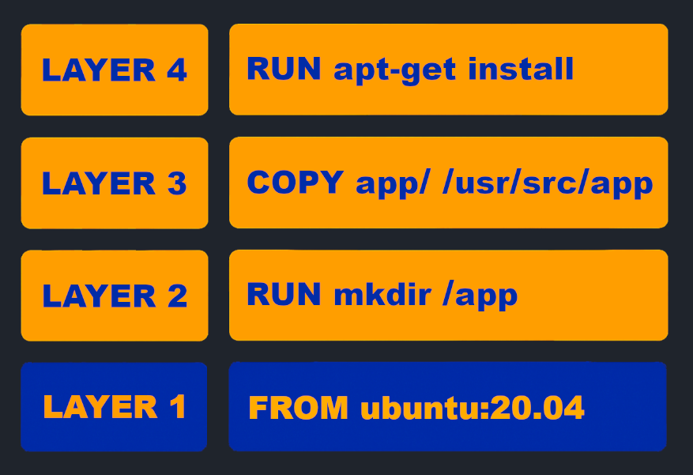
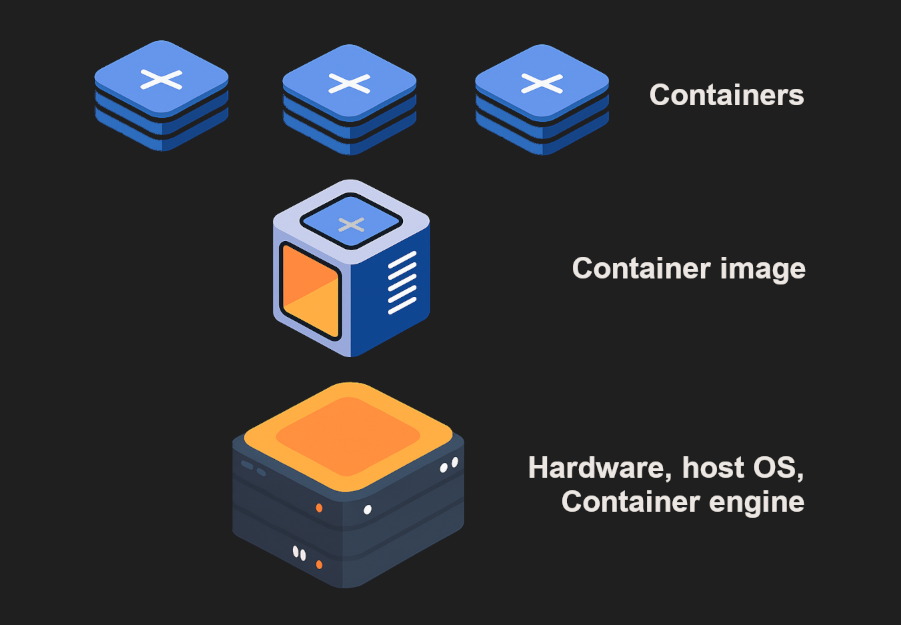
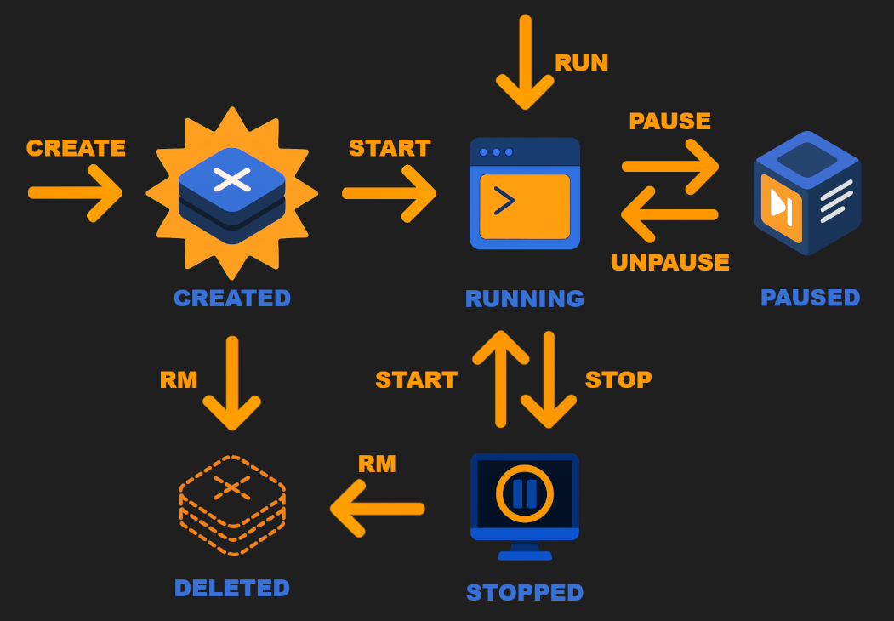
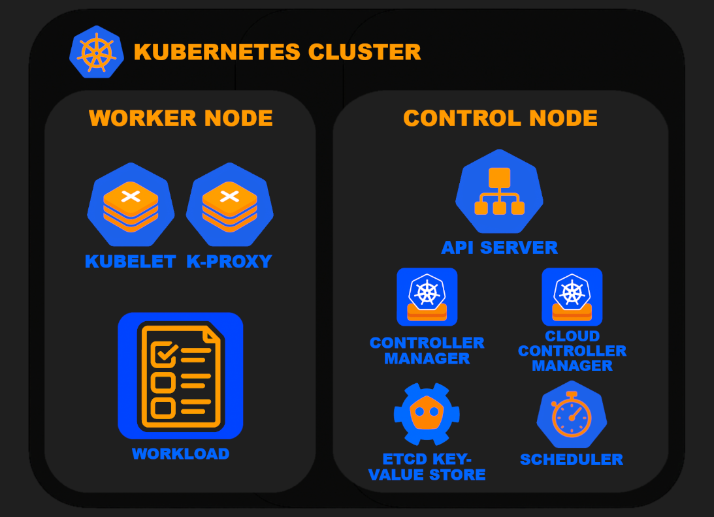

# 📦 Container Technologies

This chapter documents the best practices, standards, and deployment workflows for containerized applications. Containers are lightweight, replicable environments that package your application code along with its dependencies. The following sections cover how to build efficient Docker images, secure your build process, and deploy to Kubernetes using local clusters:

📁 Navigation

- [⚙️ What are base images and containers?](#️-what-are-base-images-and-containers)

- [🖥️ Development with Docker](#️-development-with-docker)

- [🐳 Dockerfile conventions](#-dockerfile-conventions)

- [☸️ Deployment with Kubernetes (k8s)](#️-deployment-with-kubernetes-k8s)

 

## ⚙️ What are base images and containers?

Before the rise of microservice architecture, even large projects were built using **monolithic architecture**. In this model, all components of an application were built and deployed as a single unit. While it makes development straightforward, even a small one-line change in a single layer requires a rebuild of the entire application. This slows down development in the long run and can introduce bugs across unrelated parts of the system. Scaling a monolithic system requires creating multiple instances of the service, wasting resources.

In contrast, **modular software** breaks down the application into smaller independent services, each with their own responsibility. Each service handles a specific section, such as the frontend, backend, or database, and they can be developed separately using technologies that best fit each use case. Scaling a modular application is efficient, as a specific service can be scaled when it needs more resources. This makes development and maintenance faster and more efficient while also isolating failures to individual services. When modular software is coupled with **cloud-native development technologies** like containerization and Kubernetes, the benefits of using independent microservices to build applications shine by allowing teams to collaborate in efficiently building and maintaining resilient applications.

### Container Images
In container technologies like Docker, a **base image** is a read-only template that contains essential files, libraries, and tools needed to build and run application environments. Base images are used as the foundation for creating custom images. These images include everything that a container needs to run, such as application-specific libraries, configuration settings, and the specified workload. The most minimal base image is [scratch](https://hub.docker.com/_/scratch), which represents an empty image with no operating system or utilities. Images built directly from scratch are considered base images. Most Dockerfiles, however, start with a more complete image like debian, alpine, or node. These are called **parent images** because they extend from a previous image layer. Both base and parent images are often referred to as base images.

Every Docker image is made up of stacked **layers**. Each layer represents an instruction in your [Dockerfile](https://docs.docker.com/build/concepts/dockerfile/), such as `RUN`, `COPY`, or `ADD`. These layers stacked on top of one another form the final image. Because layers are cached and shared:
- Reusing the same base images between different projects speeds up builds
- Making changes earlier in the Dockerfile (in lower layers) causes more downstream layers to be rebuilt
- Keeping the most stable parts of your image early in the Dockerfile maximizes caching efficiency

<em>Docker Image Layers Example: A Docker image is a stacked series of read-only layers, each representing an instruction in the <code>Dockerfile</code>. Together, these layers form a complete application environment. First <code>FROM</code> gets Ubuntu version 20.04 as a base image, <code>RUN</code> creates a directory <code>/app</code> and <code>COPY</code> copies files from the local project directory to the image, and <code>RUN</code> can install additional packages such as curl, git, or python. </em>

---

### Containers

Containers are executable instances of images that package an application together with all of its dependencies, configurations, and environment variables. Containers run in an isolated environment separate from the host system with their own allocated resources to ensure consistent performance across different deployment platforms like local machines, servers, or cloud platforms, regardless of their operating system or other installed software.

<em>Container Architecture Overview: Multiple containers created from one image, running in parallel on top of the hardware and host OS, sharing the system kernel while staying isolated. Layers in the image stack build the runtime environment.</em>

The benefit of containerization is that it allows applications to be run anywhere without having to worry about system differences like operating systems or installed software. Their small size in relation to e.g., virtual machines makes them lightweight to run and easy to distribute. Containers help ensure that your app functions in the same way regardless of where it is deployed, making development, testing, and deployment smooth, especially when working in teams across multiple machines.

## 🖥️ Development with Docker

### Docker Architecture
Having a basic grasp of how Docker's operations function gives you a head start with using the service. The core components of Docker consist of the following:

1. **Docker Daemon**

    The Docker daemon, or `dockerd`, is a central background process running on the host machine that manages container lifecycles, including container creation, execution, monitoring, and termination. The daemon translates and executes commands given by the client within the Docker environment using host operating system resources.

2. **Docker Client**

    The Docker client is the CLI for interacting with the Docker ecosystem to build, deploy, and manage containerized applications using commands such as `docker build`, `docker run`, and `docker stop`. Commands issued from the client are sent through the Docker REST API to the Docker daemon.

3. **Docker Engine**

    Docker Engine is the open-source containerization technology that creates and manages containers. It includes the Docker daemon, REST API, and CLI. Docker Engine can run on Linux natively or on Windows/Mac through virtualization.

4. **Docker Registry**

    The Docker registry stores Docker images to be shared publicly or privately. [Docker Hub](https://hub.docker.com/) is a public registry from which anyone can upload and download images, and it is set as the default registry. A repository is a collection of related images within a registry.

5. **Docker Objects**

    In addition to the previously mentioned images and containers, Docker has other important objects that support containerized development:

    - **Docker volumes:** Used for persistent storage. Volumes allow data to persist independently of container lifecycles, making them ideal for databases or shared files between containers.

    - **Docker networks:** Enable communication between containers and with external workloads. [Docker networks](https://docs.docker.com/engine/network/) enable isolated communication, service discovery, and multi-container application setups.

6. **Docker Compose:**

    Even simple applications built using Docker often contain multiple services, such as a web frontend, a backend, a database, etc. Juggling all services separately is difficult, but Docker Compose simplifies everything by allowing the management of multiple services as a single unit.

    Docker Compose automatically creates a dedicated network for the services defined in a docker-compose.yml file. This allows containers to communicate with each other using their service names as hostnames. Additionally, port mappings in the YAML file can be used to expose specific services to the host system or external users.

**Docker Engine** is the open-source technology that runs Docker's containerization, and on top of this, there is a commercial product available called **Docker Desktop**. Docker Desktop packages Docker Engine together with additional developer-focused features which makes it convenient for local development, especially when using macOS or Windows. 

However, everything that can be done using Docker Desktop can also be handled using the open-source CLI tools.

---

### Docker Lifecycle

<em>Docker container lifecycle: This diagram illustrates the lifecycle of a Docker container, showing how it transitions between states via various Docker CLI commands. In blue, the container state is represented, and Docker CLI commands (e.g., <code>docker run</code>, <code>docker stop</code>) are shown with orange arrows, which change the container from one state to another.</em>

---

### Docker Installation and Environment Setup

Docker setup varies slightly depending on your system:

- Linux: Install via your package manager or Docker's official repositories
- Windows/Mac: Use Docker Desktop (proprietary) or set up Docker Engine in a VM (recommended)

After you have it installed, verify Docker is working by running `docker --version`.

Let's start with the classic hello-world. Open a terminal and run `docker run hello-world`:

    $ docker run hello-world
    Unable to find image 'hello-world:latest' locally
    latest: Pulling from library/hello-world
    e6590344b1a5: Pulling fs layer
    e6590344b1a5: Download complete
    e6590344b1a5: Pull complete
    Digest: sha256:940c619fbd418f9b2b1b63e25d8861f9cc1b46e3fc8b018ccfe8b78f19b8cc4f
    Status: Downloaded newer image for hello-world:latest

    Hello from Docker!
    ...

A lot happens quickly. First, we see that Docker was unable to find `hello-world:latest` locally, so it pulls it from the web. When Docker can't find an image on the local machine, it reaches out to Docker Hub, the default public registry, to pull the image. 

Here, `hello-world` is the name of the image, and `latest` is the tag. By default, Docker tags images with the latest tag.

Once Docker has completed pulling all image layers and saved them, the container runs and, in this case, displays the output message. If you try running the same command again, you'll notice that Docker references the already-existing image instead of pulling again.

---

Now we can start with an actual example project. We are going to build a Python [Flask](https://pypi.org/project/Flask/) application that listens on port 3000 and returns a message.

**1. Run the following in a terminal to create a new folder and navigate to it:**

    mkdir my-docker-app
    cd my-docker-app

**2. Generate an app.py file using the command:**

    cat <<EOF >app.py
    from flask import Flask
    app = Flask(__name__)
    
    @app.route('/')
    def hello():
        return 'Hello World!'
    
    if __name__ == '__main__':
        app.run(host='0.0.0.0', port=3000)
    EOF

**3. Add a `requirements.txt` file containing the dependencies for the app:**

    echo "Flask==3.1.1" > requirements.txt

**4. Running the Flask project locally**

Before running everything in containers, it’s often helpful to set up a local Python virtual environment for development and testing outside of Docker.

If you don't have virtualenv installed, run:

    pip install virtualenv

Then, run the following commands in the root of your project:

    virtualenv venv
    source venv\Scripts\activate    # Use venv/bin/activate on Linux/macOS
    pip install -r requirements.txt

This creates a new virtualenv folder named venv, activates it and installs Flask to the virtualenv. Next, let's try running `app.py` in the venv. Run the following in the terminal:

    python app.py

Open your browser and visit http://localhost:3000/. You should see your Flask app's `Hello World!` response!

**5. Creating a Dockerfile:**

Let's now containerize our Flask app using Docker! Press `ctrl + c` to shut down the server, and run the following to exit the virtual environment:

    deactivate

Create a file in the same folder named `Dockerfile` (with a capital D, and no extension at the end) with the following contents:

    # Use python alpine for a smaller image size
    FROM python:3.11-alpine
    
    # Set working directory
    WORKDIR /app
    
    # Copy the dependencies and install them
    COPY requirements.txt .
    RUN pip install -r requirements.txt
    
    # Copy the rest of the app code
    COPY . .
    
    # Expose port 3000 to the host machine
    EXPOSE 3000
    
    # Run the Flask app
    CMD ["python", "app.py"]

**6. Adding a `.dockerignore` file**

Adding a `.dockerignore` file prevents unnecessary files (like venv/) from being copied into the container. Add a new file called `.dockerignore` with the following contents:

    venv/
    Dockerfile
    .dockerignore

These files are not needed inside the image, and keeping the build context clean speeds up builds.

**7. Build and run the container:**

    docker build -t my-docker-app .
    docker run -p 3000:3000 my-docker-app

Open http://localhost:3000 again; this time the response is coming from your Docker container!

---

### Multi-container development with Docker Compose

Let's continue with a more expansive example, a multi-container application using Docker Compose!

Docker Compose is a tool that lets you define and manage multi-container Docker applications using a simple YAML configuration file. It simplifies the process of configuring services, networks, and volumes in a single place. Docker Compose is ideal for small-scale workload development and testing locally when a full orchestrator is not needed. 

Docker Compose installation depends on your setup:

- Docker Desktop: Comes pre-installed
- Docker Engine: Install separately using `pip install docker-compose` or download from GitHub

If you need to install Docker Compose separately, visit: https://docs.docker.com/compose/install/

---

Let’s expand the Flask app by adding [Redis](https://www.ibm.com/think/topics/redis) as a second container using Docker Compose. Redis is an in-memory data store, often used as a database or a cache. In this case, it will store a simple counter.

**1. Update app.py to use Redis**

Replace the app.py logic with this:

    from flask import Flask
    import redis
    import os

    app = Flask(__name__)
    redis_host = os.environ.get("REDIS_HOST", "localhost")
    r = redis.Redis(host=redis_host, port=6379)

    @app.route('/')
    def hello():
        count = r.incr('hits')
        return f'Hello World! This page has been viewed {count} times.'

    if __name__ == '__main__':
        app.run(host='0.0.0.0', port=3000)

**2. Update `requirements.txt` by adding Redis**

Run the following command in your terminal to add Redis to your project's dependencies:

    echo "redis==5.0.0" >> requirements.txt

**3. Create `docker-compose.yml`**

Create the `docker-compose` file, define the Flask app service and the Redis service, and add a named volume to ensure Redis data persists even after stopping or rebuilding the containers:

    version: '3.9'

    services:
      web:
        build: .
        image: my-web-app
        ports:
          - "3000:3000"
        environment:
          - REDIS_HOST=redis
        depends_on:
          - redis

      redis:
        image: "redis:7.2-alpine"
        volumes:
          - redis-data:/data
        ports:
          - "6379:6379"

    volumes:
      redis-data:

Explanation of docker-compose.yml

- `web`: builds the Flask app image from your Dockerfile and sets the `REDIS_HOST` environment variable to `redis`, which is the name of the Redis service.
- `redis`: uses an official Redis image from Docker Hub.
- `volumes`: defines a persistent named volume `redis-data` that ensures Redis data is not lost when containers are rebuilt or restarted.
- `depends_on`: ensures Docker starts the Redis container before the Flask app.

**4. Build and run the image**

Instead of running `docker build` and then `docker run`, everything is handled just running:

    docker-compose up --build

This creates and starts a service, and attaches it to a container. You can now visit http://localhost:3000/ to see the site tracking the number of visits!

## 🐳 Dockerfile conventions

### Choose the correct base image for your build:

When creating images, you need to choose whether to use `FROM scratch` (an empty image) or a parent image (e.g. node or python) as a base. Choosing scratch is a good option for highly specialized use cases where you want full control of the environment and minimal size, but in most cases, parent images are suggested to save time and to avoid rebuilding common dependencies. 

There are many trusted base images to choose from, depending on your needs:
- [Ubuntu](https://hub.docker.com/_/ubuntu) offers a great balance between wide package coverage and size
- [Alpine](https://hub.docker.com/_/alpine), a lightweight, secure, and efficient base for images

- [Node](https://hub.docker.com/_/node), [Python](https://hub.docker.com/_/python), etc. for language-specific development environments
- [Postgres](https://hub.docker.com/_/postgres), [Redis](https://hub.docker.com/_/redis), etc. for open-source applications, such as databases

>Choosing the right base image for the job increases application security. Using official images and choosing the smallest and most compatible images for your case all decrease the amount of vulnerabilities. 

The base image you choose directly affects the security, size, and maintainability of the final image. To demonstrate levels of security in different base images, [Trivy](https://trivy.dev/latest/), an open-source tool for finding vulnerabilities and misconfigurations, is used to reveal the number of vulnerabilities:

Scanning the official Node.js image first:

    PS> docker run --rm `
      -v //var/run/docker.sock:/var/run/docker.sock `
      aquasec/trivy image node `
      | Select-String -Pattern "Total:" -Context 0,1

    > Total: 1324 (UNKNOWN: 8, LOW: 661, MEDIUM: 508, HIGH: 142, CRITICAL: 5)

Distroless images exclude the package manager and shell, reducing the attack surface by only including the files needed to run your app. Next, we'll run the same vulnerability scan on a minimal distroless Node.js image:

    PS> docker run --rm `
      -v //var/run/docker.sock:/var/run/docker.sock `
      aquasec/trivy image gcr.io/distroless/nodejs `
      | Select-String -Pattern "Total:" -Context 0,1

    > Total: 49 (UNKNOWN: 3, LOW: 14, MEDIUM: 26, HIGH: 6, CRITICAL: 0)

This output shows how using a smaller base image significantly reduces vulnerabilities, particularly critical ones.

Selecting the right base image is as much a performance decision as it is a security decision. Using lean, purpose-fit, and well-maintained images reduces vulnerabilities, speeds up builds, and leads to more predictable deployments.

---

### Build images with [multi-stage builds](https://docs.docker.com/build/building/multi-stage/)

When building a Docker image, you often need extra tools like compilers or package managers during the build process, but those tools aren't needed in the final image that actually runs your app. Using multi-stage builds lets you use one image to build your app and then a second, smaller image to run your app, making the final image smaller and less prone to vulnerabilities.

    # Build using full node image
    FROM node:20 AS builder
    WORKDIR /app
    COPY . .
    RUN npm install && npm run build

    # Runtime
    FROM gcr.io/distroless/nodejs20
    COPY --from=builder /app/dist /app
    CMD ["app/index.js"]

<em>Example: A Dockerfile builds the app using a full Node.js image, then copies only the built files into a minimal, secure distroless runtime image</em>

[Distroless images](https://github.com/GoogleContainerTools/distroless) are a great example of secure runtime images. They contain only the minimal components to run your app and exclude the package manager, shell, and even the package index. This drastically reduces the size of the image and the risk of vulnerabilities.

    ~ $ docker images | grep node
    node                       latest    c332080545f1   2 weeks ago   1.62GB
    gcr.io/distroless/nodejs   latest    b534f9b5528e   2 years ago   228MB

<em>Comparison of Docker images: Standard Node.js image (`node:latest`) is significantly larger (1.62GB) compared to the lightweight Distroless Node.js image (`gcr.io/distroless/nodejs:latest`) at just 228MB.</em>

---

### Avoid storing secrets in images:

As Docker images are made of stacked layers, secrets added in an early layer remain in that layer's snapshot even if later layers delete or mask them. This means sensitive data can still be extracted from the image which is why secrets should never be added into images. Instead, you should use runtime environment variables or secret management services.

#### Bad practice: Adding secrets to image layers

    # Add secret file to image
    COPY .env /app/.env

    # Build step that uses the secret
    RUN some-command-that-uses-secret

    # Attempt to remove secret file
    RUN rm /app/.env

<em>Problem: The <code>.env</code> file is added in an earlier layer and even though it’s removed in a later layer, it still exists in the image’s history and can be extracted.</em>

A more secure alternative is [Docker Secrets](https://docs.docker.com/engine/swarm/secrets/), a feature built into Docker Swarm. It lets you manage sensitive data outside your image and deliver it securely at runtime only to services that need them. Only selected services are granted access to the encrypted secrets.

#### What to do instead: Pass secrets at runtime using Docker Secrets

1. Create a secret:

    echo "super-secret-password" | docker secret create db_password -

2. Use the secret in a Swarm service:

    docker service create \
      --name my_app \
      --secret db_password \
      myimage:latest

3. Access it in your running container:

    cat /run/secrets/db_password

This ensures your secrets stay protected and are never included in the image itself. Secrets are mounted at runtime and automatically removed when the container stops.

---

### Always specify exact base image versions

Avoid unpredictable behavior when using `latest` tags by pinning image versions.

    # Good: Version is pinned
    FROM node:20.11.1

    # Bad: Using latest can break things unexpectedly
    FROM node:latest

>Using pinned version numbers allows you to test new version compatibility before upgrading. Relying on a `latest` tag can introduce silent updates to your images without any warnings.

---

### Use [.dockerignore files](https://docs.docker.com/build/concepts/context/#dockerignore-files)

Prevent unnecessary files from being copied into the image (e.g., .`git`, `node_modules`, `*.log`, `tmp`), which can increase build size or leak sensitive info.

    .git
    node_modules
    *.log
    tmp/
    Dockerfile
    .dockerignore
    .env

<em>Example: <code>.dockerignore</code> containing common files that should not be copied into the final image</em>

## ☸️ Deployment with Kubernetes (k8s)

A container orchestrator like Kubernetes is a system that automates the deployment, scaling, and management of containerized applications. For hosting applications, you can either run Kubernetes yourself locally or using a VM, or use a managed service like Azure Kubernetes Service (AKS).

---

### Cluster Architecture

A Kubernetes **cluster** is a set of resources that make up a system, and consists of **control nodes** and **worker nodes**.

The **control plane** contains all of the system components that make up the Kubernetes infrastructure. The components included in the plane are:

- **kube-apiserver** is the core component server that exposes the Kubernetes HTTP API and allows interactions with the cluster

- **etcd** is a highly-available key value store that contains the current state of all deployed cluster resources

- **kube-scheduler** assigns Pods to nodes based on resource availability and user-defined scheduling constraints

- **kube-controller-manager** runs controllers that regulate the state of the cluster to implement the desired Kubernetes API behavior

- **cloud-controller-manager** (optional) is an interface that allows interactions between the system and possible cloud providers

The **data plane** contains the running user-deployed application. It consists of worker nodes which contain the following components:

- **Kubelet** is responsible for managing the workloads, performs health checks on the system, and relays information to the API server in the control node

- **K-proxy** (optional) maintains networking rules (e.g., iptables) for Pod-to-Pod communication

- **Container Runtime** manages the execution and lifecycles of containers in the Kubernetes environment

<em><strong>Kubernetes Cluster Overview:</strong> Worker nodes run application workloads and communicate with the <code>kube-apiserver</code> which acts as the central hub for communication between control plane components. The <code>cloud-controller-manager</code> integrates Kubernetes with external cloud provider APIs.</em>

---

### Kubernetes Resource Types

All objects in Kubernetes are created using YAML files.

    apiVersion: v1
    kind: Pod
    metadata:
      name: mypod
    spec:
      containers:
        - name: app

<em>Anatomy of a Pod: <code>apiVersion</code>, <code>kind</code>, and <code>metadata</code> describe the Kubernetes object. <code>spec</code> defines how the object should behave.</em>

- **Pods** are the smallest deployable units which represent running processes. They contain one or more containers, storage resources and a unique IP. Pods are **ephemeral**, meaning they can be created, destroyed, and recreated dynamically based on system needs.

- **Deployment** manages the lifecycle of one or more Pods of the same kind by defining a Pod template, resource requirements, and the desired number of replicas. The Deployments use **ReplicaSets** to create and scale Pods, and replace failed Pods with new replicas so that the number always stays the same. Deployments are used to handle [Stateless applications](https://www.redhat.com/en/topics/cloud-native-apps/stateful-vs-stateless) which are easily replaceable as they do not hold any persistent data (e.g. web server).

- **StatefulSets** are similar to a Deployments but for stateful applications (e.g. databases). They assign a stable identity to each Pod (e.g., pod-0, pod-1) and maintain persistent storage across restarts by reattaching volumes based on the Pod’s identity.

- **DaemonSet** runs a copy of the specified Pod on selected nodes in the cluster, and are added and deleted in the same manner as ReplicaSets. They are commonly used for background system tasks like log collection, monitoring agents, or network plugins.

- **Job** is a workload that needs to be executed once, running it to completion. The requirements of what completion can mean for a task can be modified. **CronJob** is used to execute a job periodically according to a schedule, and uses a [CronJob scheduler](https://crontab.guru/).

- **Services** are used to set an unchanging location for a group of Pods so that they can be accessed consistently even though they are dynamic. When a Pod is recreated, its IP address changes with it. When Pods are tied to a Service, they automatically receive the Service's static IP and DNS entry.

- **Namespaces** are used for organizing your cluster by grouping together elements. By default, all resources go into the `default` namespace. Common practice is to create namespaces such as `dev`, `test`, and `prod` to isolate and organize resources across environments.

---

### Deploying a Multi-Container App Locally with Kubernetes

If you’ve already set up a multi-container app using Docker Compose, you can now deploy it to Kubernetes using Kompose, a tool that helps convert Compose files into Kubernetes manifests.

**1. Enable Kubernetes in Docker Desktop**

Make sure Kubernetes is enabled in your Docker Desktop by going to Settings, Kubernetes and making sure Enable Kubernetes is on. Then, make sure your `kubectl` context is set to Docker Desktop’s Kubernetes cluster using:

    kubectl config use-context docker-desktop

**2. Install Kompose**

In this tutorial, we are converting the Docker Compose application into a Kubernetes-compatible application. Kompose helps bridge the gap between Compose and Kubernetes by automatically generating the required YAML configuration files. Start by downloading and installing Kompose from the official site:

https://kompose.io/installation/

Follow the instructions for your OS.

**3. Convert Compose to Kubernetes manifests**

Run the following command in the directory with your `docker-compose.yml` to generate Kubernetes manifests:

    kompose convert

**4. Add imagePullPolicy to your web deployment**

Open `web-deployment.yaml` and under the container spec add the line `imagePullPolicy: ifNotPresent`:

    spec:
        containers:
          - env:
              - name: REDIS_HOST
                value: redis
            image: my-web-app
            name: web
            imagePullPolicy: ifNotPresent
            ports:
              - containerPort: 3000
                protocol: TCP
        restartPolicy: Always

This tells Kubernetes to use the local image you’ve built, if there is no image with the name `my-web-app` present locally.

**5. Apply the manifests to your cluster**

Run:

    kubectl apply -f .

“This will deploy your application by creating all the necessary resources like Deployments, Services, and PersistentVolumeClaims.

**6. Check your pods and services**

Check the status of your pods:

    kubectl get pods

Check your services:

    kubectl get svc

You should see both the `web` and `redis` Pods in a Running state, along with corresponding Services.

**7. Deploy your app locally**

Port forward the web service to your local machine:

    kubectl port-forward svc/web 3000:3000

Then open your browser and navigate to http://localhost:3000 to access your web application.

#### Access pod terminal

You can open a shell inside a running web pod with:

    kubectl exec -it <pod-name> -- /bin/sh

Replace `<pod-name>` with the name of your running pod, which you can find by running `kubectl get pods`:

    kubectl exec -it <pod-name> -- /bin/sh

#### Scale your deployments

You can scale your application by adjusting the number of replicas. For example, to scale the web deployment to 3 replicas:

    kubectl scale deployment web --replicas=3
    kubectl get pods

Scale down both web and redis:

    kubectl scale deployment web --replicas=0
    kubectl scale deployment redis --replicas=0
    kubectl get pods
    kubectl get deployments

#### Examining the created files

Finally, let’s review the `YAML` files that `kompose convert` generated. These files describe the structure of your Kubernetes deployment. In your app folder, you should see the following files:

- `web-deployment.yaml` defines a `Deployment` for the web application and manages its lifecycle.

  - Sets kind as `Deployment` to manage the Flask app workload

  - Starts one Pod instance with `replicas: 1`

  - Defines an environment variable `REDIS_HOST` as `redis` for connecting to Redis

  - Exposes the port 3000 for web traffic inside the container

- `web-service.yaml` provides a stable network endpoint for accessing the Pod

  - Sets kind as `Service` to expose the web app inside the Cluster

  - Forwards traffic through port 3000 to the `web` Pods

  - Uses a Service selector to identify `web` Pods that it should route traffic to

- `redis-deployment.yaml` creates a Deployment for the Redis service running inside the cluster 

  - Uses the `redis:7.2-alpine` image to create the database

  - Mounts volume to `/data` to persist Redis data

- `redis-service.yaml` provides stable networking so other Pods can connect to Redis using a consistent DNS name within the Cluster

  - Routes traffic through port 6379 and to Pods with label `redis`

- `redis-persistentvolumeclaim.yaml` defines persistent storage for Redis so that data is retained even if the Pod restarts

Continue reading the [`cloud/README.md`](cloud/README.md) chapter to learn how to deploy and manage your containerized applications using Kubernetes and cloud-native tools for full-stack app delivery.